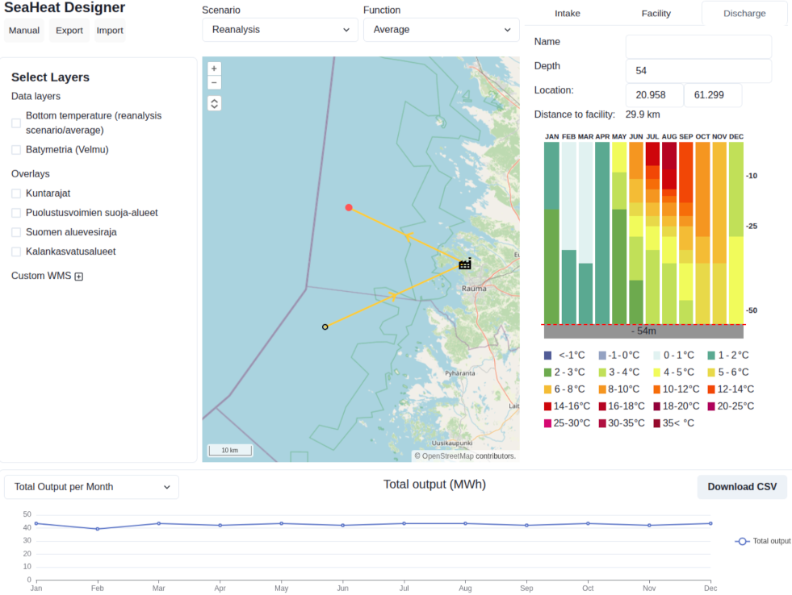
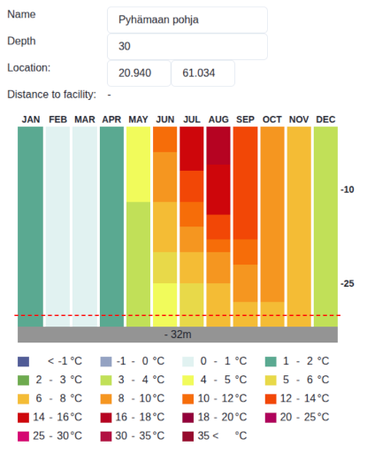
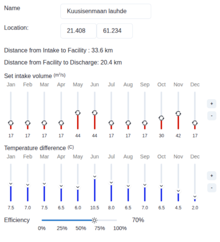
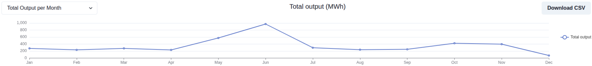
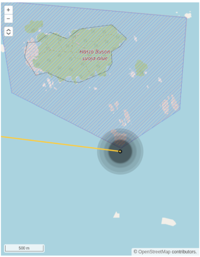
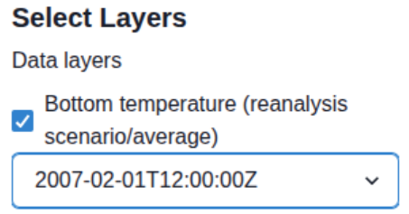

# Seaheat Designer - User Manual

This tool is for simulating evaluating environmental effects and efficacy of sea heat extraction in the Baltic Sea. The tool is based on a simple model of an extraction facility with a single intake, facility location and a single discharge location. The simulations are based on long term forecasts produced by the Finnish Meteorological Institute (https://fmi.fi). Underlying data includes multiple different future scenarios regarding global warming. The application is written by Spatineo Oy (https://spatineo.com)

## Getting started

1. Ensure the *Intake* tab is selected from the right hand side, then click on map to set intake location
2. Enter a value for depth (positive number)
3. Select the *Facility* tab, then click on map to set facility location
4. Select the *Discharge* tab, then click on map to set discharge location
5. Enter a value for depth (positive number)

After the above choices are made, the application has all the basic configuration needed to make in order to perform the analysis.

# Data

**TODO**: We need a description or link to relevant publications here

| Scenario                         | Description |
| -------------------------------- | ----------- |
| Reanalysis                       |             |
| RCP 4.5 - long term (2069-2099)  |             |
| RCP 4.5 - short term (2030-2060) |             |
| RCP 8.5 - long term (2069-2099)  |             |
| RCP 8.5 - short term (2030-2060) |             |

Functions: average, min, max, 10th percentile, 90th percentile

The data is accessed via FMI's [EDR](https://ogcapi.ogc.org/edr/EDR) API: https://ext-seaheat-smartmet-server.out.ock.fmi.fi/edr/

# Features

## Saving and loading simulations

You can save and load your simulation to and from your computer by using the *Save* and *Load* buttons in the top left hand corner. The files will be saved as JSON files. To load an simulation saved earlier, you can either drag a file to the *Load* button or click the button and then choose the correct file using your system file dialog.

The saved file includes all simulation configuration, but no data. When you load a simulation configuration, the application will automatically load all necessary data.

## Intake and discharge panels

These panels show configuration of an intake or discharge (name, depth, location) as well as the temperature forcast for different depths for each month. The location of the intake, facility or discharge can be set by either writing the lat/lon coordinates in the panel, or clicking on the map when the appropriate panel is open (the click will edit the location of the marker for which the panel is open).

## Facility panel

The facility panel shows simulation options for the heat extraction facility. You can set the name and location for the panel similarly as with the intake and discharge panels. You can also control the intake volume and temperature difference month-by-month. There are also controls to increase or decrease either parameter for all months of the year at the same time. You can also set the expected efficiency level of the facility.

## Simulation results

Based on the simulation parameters, the software calculates a number of outputs. You can choose to see the graph you are interested in by using the dropdown selector on the top left hand corner. To export the results, you can click the *Download CSV* button on the top right hand corner.

Available results:

* Total Output per Month
* Power per Month
* Temperature at intake depth
* Temperature at discharge depth
* Water throughput volume
* Discharge water temperature
* Discharge temperature difference
* Discharge impact radius (see section *Discharge impact area*)

If instead of a graph, you see a text "No data series", it means you are missing a simulation parameter. For example the depth setting for either the intake or the discharge. Refer to the "Getting started" section of this manual.

## Discharge impact area visualisation

Discharge impact means an estimate of the size of the area that will be affected or disrupted by the introduction of new water. The discharged water will be of a different temperature and different salinity compared to the discharge location at depth. The map will show a visualisation of the affected area by a method of displaying a circle centered on the impact area. The circle is made up of individual month-by-month circles that are drawn at a constant transparency level.

Lighter impact area: the impact reaches that part of the circle for a duragion of the year
Darker impact area: the area will be affected for a longer duration during the year

For more accurate analysis, use the discharge impact radius graph and the measurement tool.

## The Map

The map features a background map and a selection of data layers and overlays as well as any custom WMS layers you want to configure. The preset layers are enabled and disabled by clicking the checkbox. For overlays, the order of the layers is determined by the order in which the layers were enabled. To bring a overlay to the top, disable and enable the layer again. 

Note that some WMS layers are resolution-sensitive and may not render at all zoom levels (for example the Batymetria layer will only appear when zoomed in enough)

### Bottom temperature layer

The bottom temperature layer shows data from long term sea heat forecasts. The layer reflects the chosen scenario and function selections. The layer also features a time dimension selector that you can use to choose for which month of year you want to visualise sea bottom temperature.

### Custom WMS layer

1. Click the [+] icon next to the *Custom WMS* header
2. Enter in the WMS GetCapabilities url (for example https://gtkdata.gtk.fi/arcgis/services/EMODnet/EMODnet_Geology/MapServer/WmsServer?SERVICE=WMS&REQUEST=GetCapabilities)
3. Click *Connect*
4. Select the layer you want from the list
5. Click *Add* (lower right corner)

After this, you can enable / disable the custom WMS layer as with the other layers.

You can remove the custom WMS layer by clicking on the trash can icon of that layer.

### Measurement tool

You can do distance measuring by clicking on the measurement tool on the top left corner of the map, under the zoom buttons (see screenshot below).

You can make multiple measurements and each measurement may have a single or multiple line segments. Drawing is started by clicking on the map. Waypoints are set by clicking on the next location and you can finish drawing by double-clicking. The measurements will vanish when you disable the tool.

